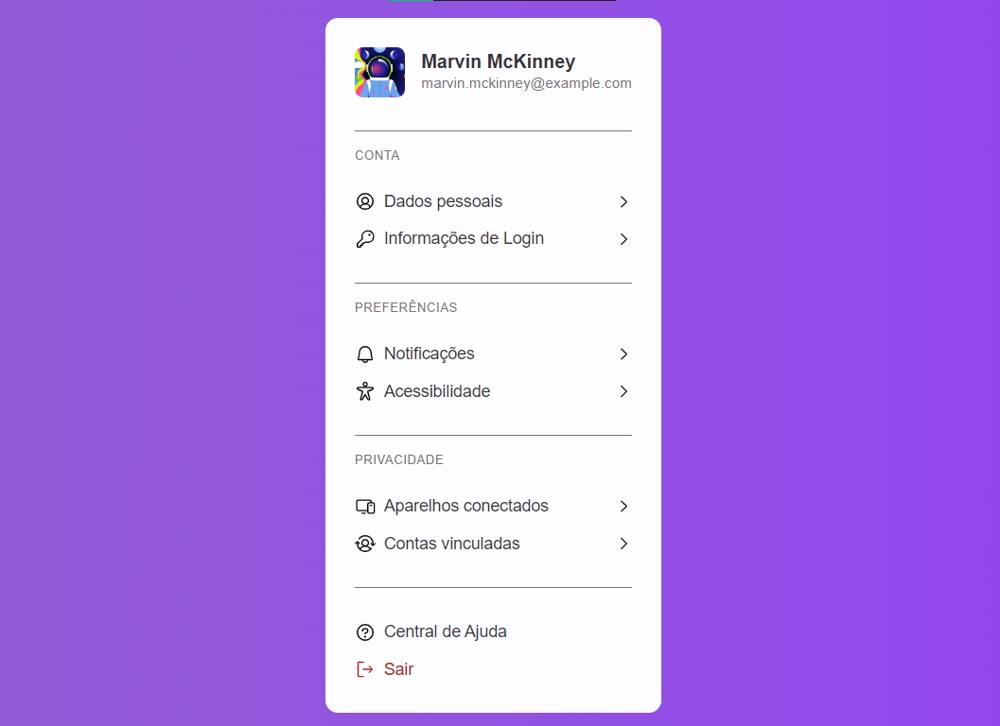

# UI Configurações de Perfil

## ❓ Sobre

Projeto de réplica de Interface do Usuário: Interface de Configurações de Perfil.

Desafio proposto pela Rocketseat no #BoraCodar.

---

## ⭐ Conceitos e Tecnologias

- ReactJS
- ViteJS
- Stitches
- TypeScript
- Figma
- GIT
- Iteração em Componentes

---

## 🖥 Visualização

---

    
 &copy; Vitor Santos

